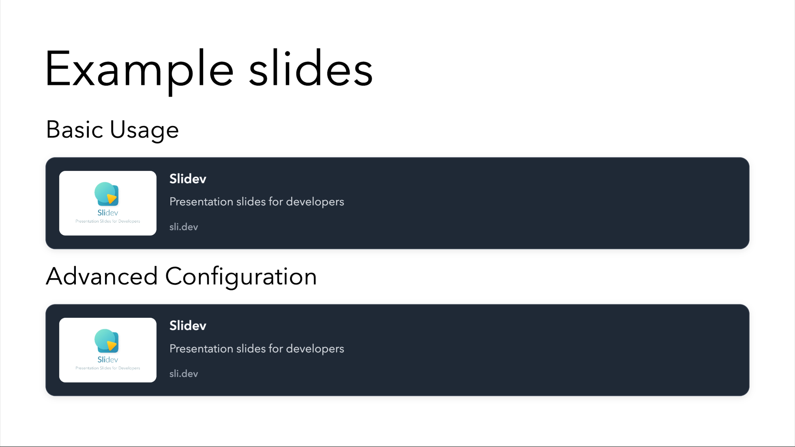

# Slidev OGP Image Add-on

A Slidev addon that displays Open Graph Protocol (OGP) data from URLs as interactive cards in your presentations.

## Features

- **OGP Data Display**: Renders Open Graph meta tags as formatted cards
- **Vue Component Integration**: Provides a reusable Vue component for Slidev
- **Interactive Cards**: Displays clickable cards with page information
- **Error Handling**: Graceful fallbacks when OGP data is unavailable
- **Click-to-Open**: Opens URLs in new tabs when cards are clicked

## Example

[example.md](./example.md)  


## Installation

```bash
npm i @katzumi/slidev-addon-ogp-image
```

## Usage

Add the addon to your `slides.md` frontmatter:

```yaml
---
addons:
  - "@katzumi/slidev-addon-ogp-image"
---
```

Use the component in your slides:

```vue
<OgpImage url="https://github.com/k2tzumi/slidev-addon-ogp-image" />

<OgpImage 
  url="https://github.com/k2tzumi/slidev-addon-ogp-image"
  :width="800"
  :height="400"
/>
```

## Component Properties

- `url` (required): URL to fetch OGP data from
- `width`: Display width for the card (default: 1200px)
- `height`: Display height for the card (default: 630px)

## Project Structure

```
slidev-addon-ogp-image/
├── index.ts                    # Main addon entry point
├── setup/
│   └── main.ts                # Client setup
├── lib/
│   └── ogp-generator.ts       # OGP fetching and processing logic
├── components/
│   └── OgpImage.vue           # Vue component
└── assets/
    └── NotoSansJP-Bold.ttf    # Optional font file
```

## Examples

### Single Link

```markdown
---
addons:
  - "@katzumi/slidev-addon-ogp-image"
---

# Check out this resource

<OgpImage url="https://docs.microsoft.com/en-us/azure/" />
```

### Multiple Links

```markdown
---
# Multiple Links

<div class="grid grid-cols-2 gap-4">
  <OgpImage url="https://vuejs.org/" />
  <OgpImage url="https://react.dev/" />
</div>
```

## Technical Limitations

### Browser Security Restrictions

Due to browser same-origin policy restrictions, this addon has the following limitations:

- **CORS Restrictions**: Direct fetching of OGP data from external domains is blocked by browsers
- **Proxy Dependency**: Requires external CORS proxy services for cross-origin requests
- **Network Reliability**: Dependent on third-party proxy service availability

### Recommended Usage

- **Development**: Suitable for development and demonstration purposes
- **Production**: Consider server-side OGP fetching for production environments
- **Fallbacks**: Always provide fallback content when OGP data is unavailable

## Browser Compatibility

- Modern browsers with ES2015+ support
- Chrome 60+
- Firefox 55+
- Safari 11+
- Edge 79+

## Development

### Setup

```bash
# Install dependencies
npm install

# Build the addon
npm run build

# Watch mode for development
npm run dev
```

### Local Development

The addon is designed to work as a local addon in your Slidev project. For development:

1. Clone this repository
2. Install dependencies
3. Link to your Slidev project for testing

## Contributing

Contributions are welcome! Please ensure all code follows the project's coding standards and includes appropriate tests.

## License

MIT License - see LICENSE file for details.

## Acknowledgments

This addon builds upon the Slidev ecosystem and leverages Vue.js component architecture for seamless integration with presentation workflows.